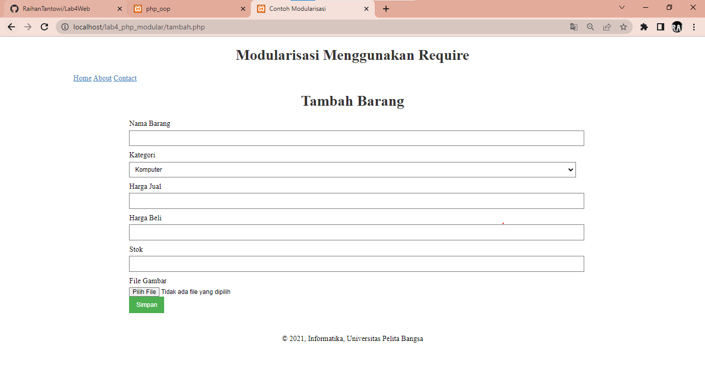

# Lab4Web
### *Pratikum 4 (PHP Modular)*
```
Nama             : Raihan Tantowi
Nim              : 312110229
Dosen Pengampu   : Agung Nugroho, S.Kom., M.Kom
Mata Kuliah      : Pemrograman Web 2
```

#### Berikut adalah langkah"nya :
##### 1. Membuat folder baru dengan nama **"lab4_php_modular"** didalam folder (htdocs) yang ada pada folder xampp
##### 2. Buat file baru dengan nama header.php
```php
<!DOCTYPE html>
<html lang="en">
<head>
<meta charset="UTF-8">
<title>Modular require</title>
<link href="style.css" rel="stylesheet" type="text/stylesheet"
media="screen" />
</head>
<body>
<div class="container">
<header>
<h1>Data Barang</h1>
</header>
<nav>
<a href="tambah.php">Tambah</a>
<a href="ubah.php">Ubah</a>
<a href="hapus.php">Hapus</a>
</nav>
```

##### 3. Buat file baru dengan nama footer.php
```php
<footer>
<p>&copy; 2021, Informatika, Universitas Pelita Bangsa</p>
</footer>
</div>
</body>
</html>
```

##### 4. Buat file baru dengan nama tambah.php
```php
<?php require('header.php'); ?>
<div class="content"><p>
<?php
error_reporting(E_ALL);
if (isset($_POST['submit']))
{
 $nama = $_POST['nama'];
 $kategori = $_POST['kategori'];
 $harga_jual = $_POST['harga_jual'];
 $harga_beli = $_POST['harga_beli'];
 $stok = $_POST['stok'];
 $file_gambar = $_FILES['file_gambar'];
 $gambar = null;
 if ($file_gambar['error'] == 0)
 {
 $filename = str_replace(' ', '_',$file_gambar['name']);
 $destination = dirname(__FILE__) .'/gambar/' . $filename;
 if(move_uploaded_file($file_gambar['tmp_name'], $destination))
 {
 $gambar = 'gambar/' . $filename;;
 }
}
$sql = 'INSERT INTO data_barang (nama, kategori,harga_jual, harga_beli, 
stok, gambar) ';
$sql .= "VALUE ('{$nama}', '{$kategori}','{$harga_jual}', 
'{$harga_beli}', '{$stok}', '{$gambar}')";
$result = mysqli_query($conn, $sql);
header('location: index.php');
}
?>
<!DOCTYPE html>
<html lang="en">
<head>
<meta charset="UTF-8">
<link href="style.css" rel="stylesheet" type="text/css" />
<title>Tambah Barang</title>
</head>
<body>
<div class="container">
<h1>Tambah Barang</h1>
<div class="main">
<form method="post" action="tambah.php" enctype="multipart/formdata">
<div class="input">
<label>Nama Barang</label>
<input type="text" name="nama" />
</div>
<div class="input">
<label>Kategori</label>
<select name="kategori">
<option value="Komputer">Komputer</option>
<option value="Elektronik">Elektronik</option>
<option value="Hand Phone">Hand Phone</option>
</select>
</div>
<div class="input">
<label>Harga Jual</label>
<input type="text" name="harga_jual" />
</div>
<div class="input">
<label>Harga Beli</label>
<input type="text" name="harga_beli" />
</div>
<div class="input">
<label>Stok</label>
<input type="text" name="stok" />
</div>
<div class="input">
<label>File Gambar</label>
<input type="file" name="file_gambar" />
</div>
 <div class="submit">
 <input type="submit" name="submit" value="Simpan" />
 </div>
 </form>
 </div>
</div>
</body>
</html>
</p>
</div>
<?php require('footer.php'); ?>
```

#### 5. Buat file baru dengan nama ubah.php
```php
<?php require('header.php'); ?>
<div class="content">
<p>
<?php
error_reporting(E_ALL);
if (isset($_POST['submit']))
{
 $nama = $_POST['nama'];
 $kategori = $_POST['kategori'];
 $harga_jual = $_POST['harga_jual'];
 $harga_beli = $_POST['harga_beli'];
 $stok = $_POST['stok'];
 $file_gambar = $_FILES['file_gambar'];
 $gambar = null;
 if ($file_gambar['error'] == 0)
 {
 $filename = str_replace(' ', '_',$file_gambar['name']);
 $destination = dirname(__FILE__) .'/gambar/' . $filename;
 if(move_uploaded_file($file_gambar['tmp_name'], $destination))
 {
 $gambar = 'gambar/' . $filename;;
 }
}
$sql = 'INSERT INTO data_barang (nama, kategori,harga_jual, harga_beli, 
stok, gambar) ';
$sql .= "VALUE ('{$nama}', '{$kategori}','{$harga_jual}', 
'{$harga_beli}', '{$stok}', '{$gambar}')";
$result = mysqli_query($conn, $sql);
header('location: index.php');
}
?>
<!DOCTYPE html>
<html lang="en">
<head>
<meta charset="UTF-8">
<link href="style.css" rel="stylesheet" type="text/css" />
<title>Ubah Barang</title>
</head>
<body>
<div class="container">
<h1>Ubah Barang</h1>
<div class="main">
<form method="post" action="ubah.php" enctype="multipart/formdata">
<div class="input">
<label>Nama Barang</label>
<input type="text" name="nama" />
</div>
<div class="input">
<label>Kategori</label>
<select name="kategori">
<option value="Komputer">Komputer</option>
<option value="Elektronik">Elektronik</option>
<option value="Hand Phone">Hand Phone</option>
</select>
</div>
<div class="input">
<label>Harga Jual</label>
<input type="text" name="harga_jual" />
</div>
<div class="input">
<label>Harga Beli</label>
<input type="text" name="harga_beli" />
</div>
<div class="input">
<label>Stok</label>
<input type="text" name="stok" />
</div>
<div class="input">
<label>File Gambar</label>
<input type="file" name="file_gambar" />
</div>
 <div class="submit">
 <input type="submit" name="submit" value="Simpan" />
 </div>
 </form>
 </div>
</div>
</body>
</html>    
</p>
</div>
<?php require('footer.php'); ?>
```

#### 6. Buat file baru dengan nama hapus.php
```php
<?php require('header.php'); ?>
<div class="content">
<h1>Ini Halaman Hapus</h1>
<h3>Tidak ada data</h3>
</div>
<?php require('footer.php'); ?>
```

#### 7. Membuat routing untuk mempermudah akses halaman web agar SEO Friendly. Perlu menyiapkan file utama (index.php) yang berisi routing untuk mengakses banyak halaman.
#### Contohnya:

```
• Halaman Tambah barang ( http://localhost/lab4_php_modular/index.php?mod=tambah)
• Halaman Ubah barang ( http://localhost/lab4_php_modular/index.php?mod=ubah )
• Halaman Hapus barang ( http://localhost/lab4_php_modular/index.php?mod=hapus )
```

#### 8. Buat file baru dengan nama index.php
```php
<?php
$mod = $_REQUEST['mod'];
switch ($mod) {
case "tambah":
require("tambah.php");
break;
case "ubah":
require("ubah.php");
break;
case "hapus":
require("hapus.php");
break;
require("tambah.php");
}
?>
```

#### 8. Aktivasi mod_rewrite (.htaccess)
Mod_rewrite digunakan untuk mengubah URL dari query string menjadi SEO Friendly.

```
• Pertama aktivasi mod_rewrite pada webserver Apache2 pada
configurasi/edit di file httpd.conf
• Aktifkan LoadModule mod_rewrite dengan cara melakukan un-comment pada baris tersebut, 
kemudian restart Apache2.
```

#### 9. Langkah berikutnya adalah membuat file .htaccess didalam folder **"lab4_php_modular"** 
```php
<IfModule mod_rewrite.c>
    RewriteEngine On
    RewriteBase /lab4_php_modular/
    RewriteCond %{REQUEST_FILENAME} !-f
    RewriteCond %{REQUEST_FILENAME} !-d
    RewriteRule ^(.*)$ index.php?mod=$1 [L]
</IfModule>
```
Penulisan link akses ke web akan menjadi singkat. Untuk cara aksesnya :
```
• Halaman Tambah barang ( http://localhost/lab4_php_modular/tambah )
• Halaman Ubah barang ( http://localhost/lab4_php_modular/ubah )
• Halaman Hapus barang ( http://localhost/lab4_php_modular/hapus )
```

#### 10. Berikut adalah hasil tampilan dari web :




