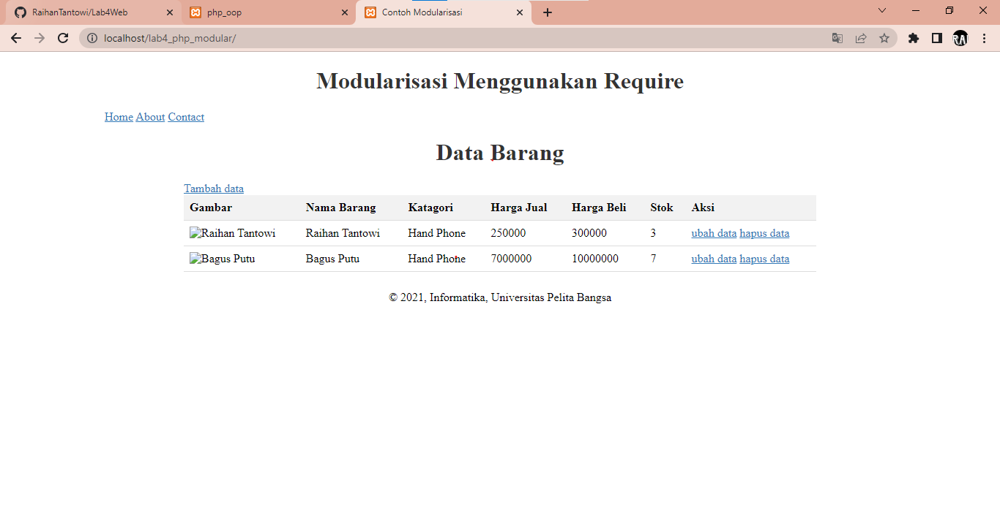
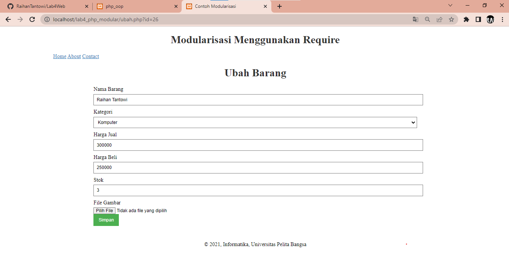

# Lab4Web
### *Pratikum 4 (PHP Modular)*
```
Nama             : Raihan Tantowi
Nim              : 312110229
Dosen Pengampu   : Agung Nugroho, S.Kom., M.Kom
Mata Kuliah      : Pemrograman Web 2
```

#### Untuk mengimplementasikan konsep modularisasi pada kode program (praktikum 3)  sebelumnya agar setiap halamannya memiliki template tampilan yang sama, berikut langkah-langkahnya :
##### 1. Pada setiap halaman di folder "lab4_php_modular" (misalnya **index.php**, **tambah.php**, **ubah.php**), tambahkan perintah require('header.php'); sebelum bagian konten dan require('footer.php'); setelah bagian konten. Contohnya, pada index.php, Tambahkan kodingannya menjadi: 
```php
<?php
include("koneksi.php");
// query untuk menampilkan data
$sql = 'SELECT * FROM data_barang';
$result = mysqli_query($conn, $sql);
require('header.php'); // Tambahkan kodingan seperti ini
?>
<!DOCTYPE html>
<html lang="en">
<head>
<meta charset="UTF-8">
<link href="style.css" rel="stylesheet" type="text/css" />
<title>Data Barang</title>
</head>
<body>
<div class="container">
<h1>Data Barang</h1>
<div class="main">
    <a href="tambah.php">Tambah data</a>
    <table>
    <!-- Tampilkan konten tabel -->
    </table>
</div>
</div>
<?php require('footer.php'); // Tambahkan kodingan seperti ini ?>
</body>
</html>
```

##### 2. Lakukan langkah yang sama pada halaman lain seperti tambah.php dan ubah.php


##### 3. Dengan mengikuti langkah-langkah di atas, setiap halaman di folder "lab4_php_modular" akan menggunakan template tampilan yang sama yang terdiri dari header dan footer yang diatur dalam file header.php dan footer.php.


#### 4. Berikut adalah HASIL PROGRAM :
* ##### Tampilan dari *"index.php"*


* ##### Tampilan dari *"tambah.php"*


* ##### Tampilan dari *"ubah.php"*

